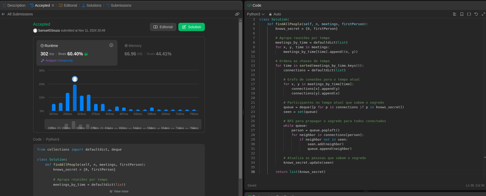
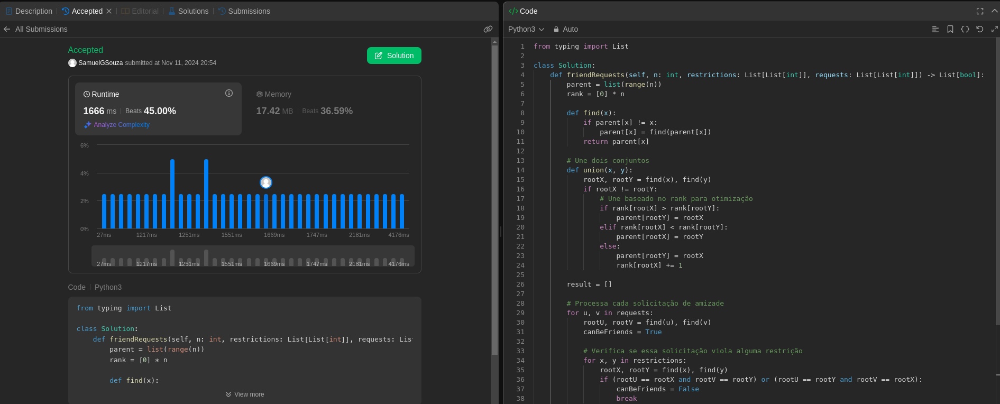
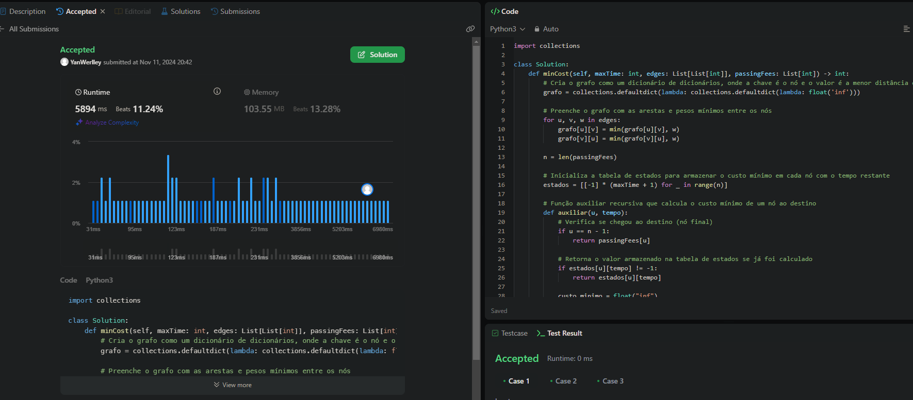

# Questões - Juíz Online

**Número da Lista**: X 
**Conteúdo da Disciplina**: Grafos 1 

## Alunos

| Matrícula  | Aluno                               |
| ---------- | ----------------------------------- |
| 21/1030649 | Yan Werlley de Freitas Paulo |
| 21/1030881 | Samuel Gomes de Souza         |

## Apresentação
A apresentação pode ser vista em: 
## Sobre

Este projeto consiste na realização de exercícios da plataforma de juiz online LeetCode. São desenvolvidos problemas Difícil e Média
complexidade sobre grafos.

## Screenshots

#### Exercício 01 - (2092)Find All People With Secret

Dificuldade: Difícil  
Descrição do Problema: [Find All People With Secret](https://leetcode.com/problems/find-all-people-with-secret/description/) 
Solução: 

#### Exercício 02 - (2076)Process Restricted Friend Requests

Dificuldade: Difícil 
Descrição do Problema: [Process Restricted Friend Requests](https://leetcode.com/problems/process-restricted-friend-requests/description/) 
Solução: 

#### Exercício 03 - (1928)Minimum Cost to Reach Destination in Time

Dificuldade: Difícil  
Descrição do Problema: [Minimum Cost to Reach Destination in Time](https://leetcode.com/problems/minimum-cost-to-reach-destination-in-time/description/) 
Solução: 

## Instalação

**Linguagem**: Python  

## Uso

<!--## Outros

Quaisquer outras informações sobre seu projeto podem ser descritas abaixo.

-->
